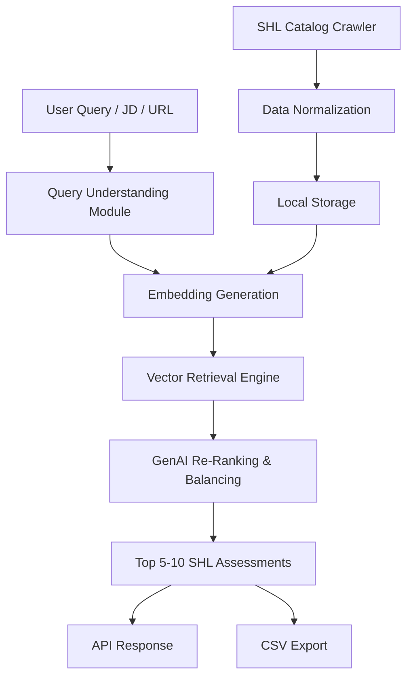
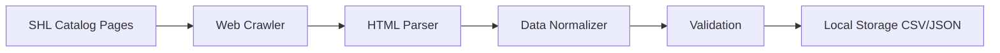
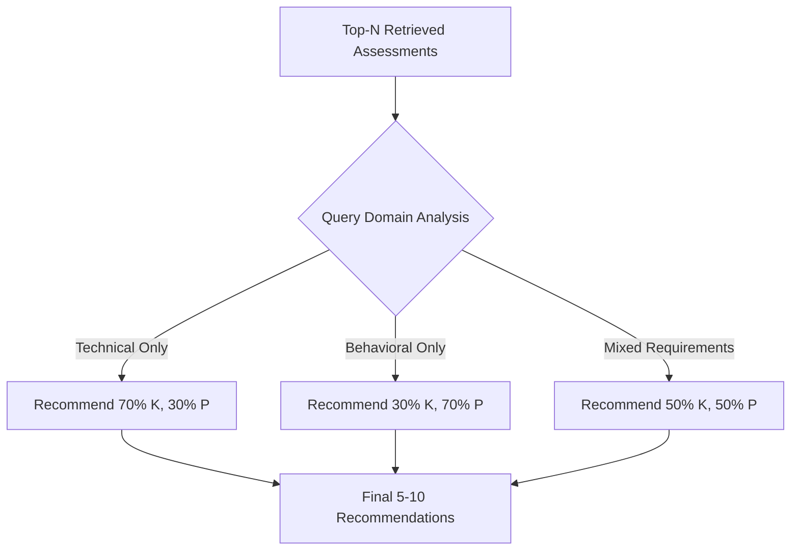
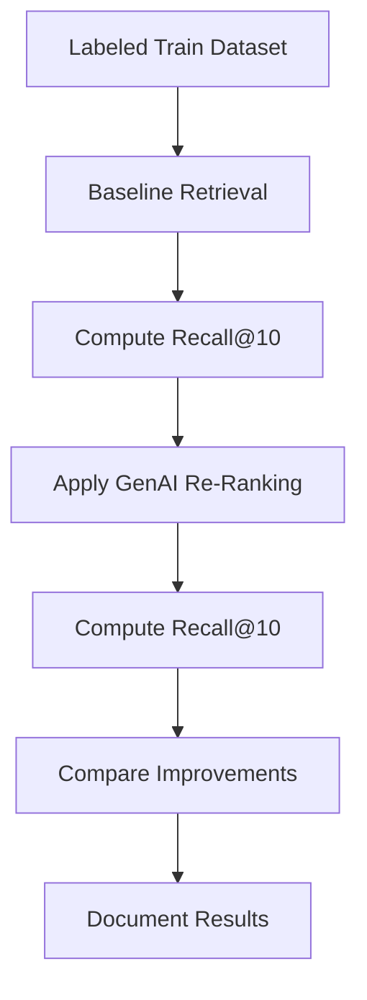

# SHL Assessment Recommendation System - Design Document

## 1. System Overview

### 1.1 Purpose
Design an intelligent, GenAI-powered recommendation system that maps natural language hiring queries or job descriptions to relevant SHL individual test solutions from their product catalog.

### 1.2 Context
Hiring managers and recruiters face challenges identifying appropriate assessments from SHL's extensive product catalog. Current keyword search and manual filtering approaches are inefficient and fail to capture nuanced requirements like balancing technical skills with behavioral competencies.

### 1.3 Constraints
- Timeline: 1-day MVP development
- Scope: Individual Test Solutions only (excludes Pre-packaged Job Solutions)
- Evaluation: Mean Recall@10 metric on labeled dataset
- Output: REST API + CSV submission format

## 2. Goals & Success Criteria

### 2.1 Primary Goals
- Build AI-driven assessment recommendation engine using SHL product catalog
- Support natural language queries, job descriptions, or JD URLs
- Return 5-10 relevant individual test solutions per query
- Ensure balanced recommendations across domains (technical + behavioral)

### 2.2 Success Metrics
- Mean Recall@10 on labeled training dataset
- Correct API behavior per specification
- CSV submission in exact required format
- Clear, reproducible, and explainable pipeline

### 2.3 Explicit Non-Goals
- Full production-grade UI
- Real-time recruiter feedback loop
- Fine-tuning large language models
- Candidate-level scoring or decision-making

## 3. User Personas & Use Cases

### 3.1 Target Users
- Hiring managers
- Recruiters
- SHL internal evaluators (assessment reviewers)

### 3.2 Example Queries

| Query Type | Example |
|------------|---------|
| Technical + Soft Skills | "I am hiring for Java developers who can collaborate with business teams" |
| Role-based | "Need an analyst screening solution using cognitive and personality tests" |
| Multi-skill Technical | "Looking to hire professionals skilled in Python, SQL, and JavaScript" |

## 4. Data Architecture

### 4.1 Primary Data Source: SHL Product Catalog

**Source Location**: https://www.shl.com/solutions/products/product-catalog/

**Acquisition Method**: Web crawling

**Inclusion Criteria**: Individual Test Solutions only

**Data Schema**:

| Field | Type | Description | Required |
|-------|------|-------------|----------|
| assessment_name | String | Name of the assessment | Yes |
| assessment_url | String | Direct URL to assessment page | Yes |
| test_type | Enum (K/P) | K: Knowledge & Skills, P: Personality & Behavior | Yes |
| description | Text | Detailed assessment description | Yes |
| category | String | Classification category | Yes |

**Storage Strategy**: Local persistence (CSV/JSON) for reproducibility and compliance

### 4.2 Secondary Data Source: GenAI Dataset

**Components**:
- Labeled training queries (for evaluation and iteration)
- Unlabeled test queries (for final CSV submission)

**Purpose**: Baseline evaluation and final output generation

## 5. System Architecture

### 5.1 Architecture Diagram



### 5.2 Component Responsibilities

| Component | Responsibility | Technology Consideration |
|-----------|---------------|-------------------------|
| Query Understanding Module | Parse and extract intent from natural language input | LLM-based (Gemini/OpenAI) |
| Embedding Generation | Convert text to vector representations | Transformer-based sentence embeddings |
| Vector Retrieval Engine | Perform similarity search to retrieve top-N candidates | Vector similarity algorithms |
| GenAI Re-Ranking & Balancing | Re-rank results and ensure K/P balance | LLM with domain-aware prompting |
| Data Crawler | Extract catalog data from SHL website | Web scraping with structure parsing |

## 6. Core Pipeline Design

### 6.1 Data Ingestion Pipeline



**Process Steps**:
1. Identify catalog pages containing Individual Test Solutions
2. Extract structured data from HTML
3. Normalize field values and handle missing data
4. Validate against schema requirements
5. Persist to local storage

### 6.2 Retrieval Pipeline (Baseline)

**Approach**: Semantic similarity using transformer-based embeddings

**Flow**:
1. Generate query embedding using pre-trained sentence transformer
2. Compute similarity scores against all assessment embeddings
3. Retrieve top-N candidates based on similarity threshold
4. Return ranked list for re-ranking stage

### 6.3 GenAI Integration Pipeline (Critical Component)

**LLM Utilization**:
- Query understanding and intent extraction
- Re-ranking retrieved assessments based on semantic relevance
- Enforcing balance between technical (K) and behavioral (P) test types

**Balancing Strategy**:



**Prompt Design Principles**:
- Explicitly specify domain balance requirements
- Provide query context and assessment metadata
- Request ranked output with justification

## 7. API Design Specification

### 7.1 Health Check Endpoint

**Endpoint**: `GET /health`

**Purpose**: Service availability verification

**Response Schema**:
```
{
  "status": "ok"
}
```

**Status Codes**:
- 200: Service operational
- 503: Service unavailable

### 7.2 Recommendation Endpoint

**Endpoint**: `POST /recommend`

**Purpose**: Generate assessment recommendations from query

**Request Schema**:
```
{
  "query": "<natural language query or job description>"
}
```

**Response Schema**:
```
{
  "recommendations": [
    {
      "assessment_name": "<name>",
      "assessment_url": "<url>"
    }
  ]
}
```

**Response Characteristics**:
- Returns 5-10 assessments per query
- Ordered by relevance score
- Balanced across K and P types when applicable

**Status Codes**:
- 200: Success
- 400: Invalid request format
- 500: Internal processing error

**Content-Type**: `application/json` only

## 8. Evaluation Strategy

### 8.1 Evaluation Metric

**Primary Metric**: Mean Recall@10

**Definition**: Proportion of relevant assessments retrieved within top-10 recommendations, averaged across all queries

### 8.2 Evaluation Methodology



**Process Steps**:
1. Execute baseline retrieval pipeline on labeled training set
2. Calculate baseline Mean Recall@10
3. Apply GenAI re-ranking with balancing
4. Recalculate Mean Recall@10
5. Measure improvement delta
6. Document findings and iterate if needed

### 8.3 Validation Approach
- Use labeled data ground truth for relevance assessment
- Track per-query performance for error analysis
- Monitor K/P balance distribution in recommendations

## 9. Output Specification

### 9.1 CSV Submission Format

**Purpose**: Final deliverable for unlabeled test set

**Schema**:

| Column | Description | Format |
|--------|-------------|--------|
| Query | Input query text | String |
| Assessment_url | Recommended assessment URL | Valid URL |

**Format Requirements**:
- Header row: `Query`, `Assessment_url`
- One row per recommendation
- Multiple recommendations per query allowed
- 5-10 URLs per unique query
- Exact column naming required

**Example**:
```
Query,Assessment_url
"Hiring Java developer with collaboration skills",https://shl.com/assessment/java-001
"Hiring Java developer with collaboration skills",https://shl.com/assessment/teamwork-002
"Need analyst with cognitive skills",https://shl.com/assessment/cognitive-001
```

## 10. Recommendation Quality Considerations

### 10.1 Domain Balance Strategy

**Requirement**: Ensure balanced recommendations when queries span multiple domains

**Implementation Approach**:

| Query Type | K (Knowledge & Skills) | P (Personality & Behavior) |
|------------|------------------------|----------------------------|
| Pure Technical | 70-80% | 20-30% |
| Pure Behavioral | 20-30% | 70-80% |
| Mixed Requirements | 40-60% | 40-60% |

**Example**:
- Query: "Java developer who collaborates with stakeholders"
- Output includes:
  - Java programming assessments (K)
  - Collaboration/communication assessments (P)
  - Stakeholder management assessments (P)

### 10.2 Relevance Optimization
- Semantic matching prioritizes description and category fields
- Assessment name carries secondary weight
- Test type used for post-retrieval balancing, not filtering

## 11. Risk Assessment & Mitigation

### 11.1 Identified Risks

| Risk | Impact | Mitigation Strategy |
|------|--------|---------------------|
| Time-bounded scraping may not cover entire catalog | Medium | Implement incremental crawling; document coverage percentage |
| LLM re-ranking depends on prompt quality | High | Iterative prompt engineering; validate against labeled data |
| Evaluation dataset size is limited | Medium | Cross-validation; document statistical confidence |
| Web scraping may break with site structure changes | Medium | Implement robust parsing with fallback logic |
| API latency from LLM calls | Medium | Implement timeout handling; consider caching |

### 11.2 Explicit Limitations
- MVP scope limits full catalog coverage
- No real-time feedback incorporation
- Static balancing ratios (not query-adaptive)
- English language only in MVP
- No personalization or user history

## 12. Future Enhancement Roadmap

### 12.1 Data Pipeline Enhancements
- Full catalog ingestion with incremental crawling
- Persistent vector database integration (FAISS/Chroma)
- Automated catalog refresh mechanism

### 12.2 Intelligence Improvements
- Query-adaptive weighting and balancing
- Multi-turn conversation support
- Context-aware recommendations based on company industry

### 12.3 Platform Expansion
- Multilingual support
- Recruiter feedback loop for continuous learning
- Integration with ATS systems
- Real-time candidate scoring

### 12.4 User Experience
- Interactive web interface
- Recommendation explanation and justification
- Bulk query processing
- Export in multiple formats

## 13. Ethical & Responsible AI Considerations

### 13.1 Data Privacy
- No personal or candidate data processed
- Only publicly available SHL catalog data used
- No user tracking or profiling

### 13.2 Transparency
- Recommendations are advisory, not prescriptive
- System limitations explicitly documented
- Balancing logic is transparent and configurable

### 13.3 Human-in-the-Loop
- Designed to augment, not replace, human judgment
- Final hiring decisions remain with recruiters
- Recommendations require human review

### 13.4 Fairness
- No demographic-based filtering or bias
- Assessment selection based purely on job requirements
- Equal consideration of all catalog items

## 14. Technical Assumptions

### 14.1 Infrastructure
- Single-instance deployment sufficient for MVP
- Standard REST API hosting environment
- Local file system for data storage

### 14.2 External Dependencies
- SHL website structure remains accessible
- LLM API availability (Gemini/OpenAI)
- Sentence transformer model availability

### 14.3 Performance Targets
- API response time: < 5 seconds per query
- Catalog ingestion: One-time batch process
- CSV generation: Batch processing acceptable

## 15. Acceptance Criteria

### 15.1 Functional Requirements
- API endpoints return responses in specified format
- Recommendations include 5-10 assessments per query
- CSV output matches exact format specification
- K/P balance observable in mixed-domain queries

### 15.2 Quality Requirements
- Mean Recall@10 measured and documented
- Improvement over baseline demonstrated
- Pipeline reproducible with documented steps

### 15.3 Deliverables
- Working REST API with both endpoints
- CSV file for unlabeled test set
- Documentation of approach and results
- Code repository with clear instructions
